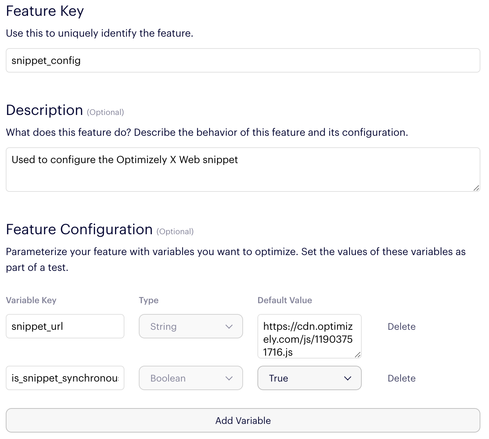

# Snippet configuration example app

This application illustrates the use of Optimizely X Full Stack to configure the Optimizely X Web snippet on a simple web page.

## Deploying the application

1. Create and run a [virtualenv](http://docs.python-guide.org/en/latest/dev/virtualenvs/)
2. Install requirements: `pip install -r requirements.txt`
3. Run the application `python application.py` (be sure the virtualenv is running)
4. You’re all set. To try this with your own Optimizely projects, modify `FULL_STACK_PROJECT_ID` and `WEB_PROJECT_ID` in `application.py`.

To see the masking in action, load

      http://localhost:4001/

in a web browser.  To view the page without masking enabled, load

      http://localhost:4001/?disablemask

## Updating the local Full Stack datafile

`application.py` is configured to load the Full Stack datafile from `./datafile.json`. To refresh the contents of this file, run

      ./update_datafile.sh <YOUR SDK KEY>

Using the [SDK Key](https://help.optimizely.com/Set_Up_Optimizely/Access_the_datafile_for_a_Full_Stack_project) for your Full Stack project. For example:

      ./update_datafile.sh FTTcU3Li4Ru1DA3LnvSMns

## The Snippet Configuration Full Stack Project

Here's a rough schema for the "Snippet Configuration" Full Stack project this application depends on:

      Full Stack "Snippet Configuration" Project
        Feature: snippet_config
          Variable: snippet_url (default value: "https://cdn.optimizely.com/js/11903751716.js")
          Variable: is_snippet_synchronous (default value: True)

